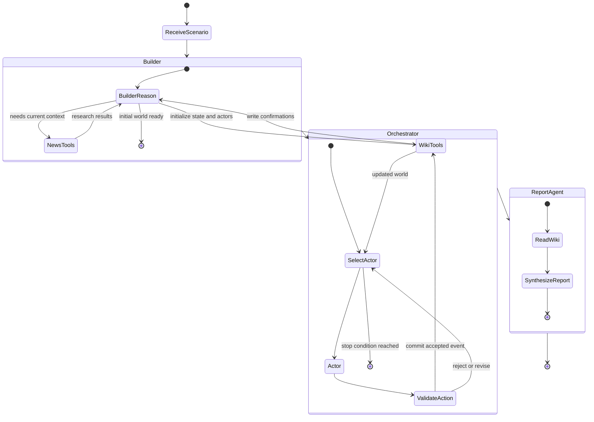

# LangGraph Agent Flow

```mermaid
stateDiagram-v2
    [*] --> ReceiveScenario
    ReceiveScenario --> Builder

    state Builder {
        [*] --> BuilderReason
        BuilderReason --> NewsTools: needs current context
        NewsTools --> BuilderReason: research results
        BuilderReason --> WikiTools: initialize state and actors
        WikiTools --> BuilderReason: write confirmations
        BuilderReason --> [*]: initial world ready
    }

    Builder --> Orchestrator

    state Orchestrator {
        [*] --> SelectActor
        SelectActor --> Actor
        Actor --> ValidateAction
        ValidateAction --> WikiTools: commit accepted event
        WikiTools --> SelectActor: updated world
        ValidateAction --> SelectActor: reject or revise
        SelectActor --> [*]: stop condition reached
    }

    Orchestrator --> ReportAgent

    state ReportAgent {
        [*] --> ReadWiki
        ReadWiki --> SynthesizeReport
        SynthesizeReport --> [*]
    }

    ReportAgent --> [*]
```

