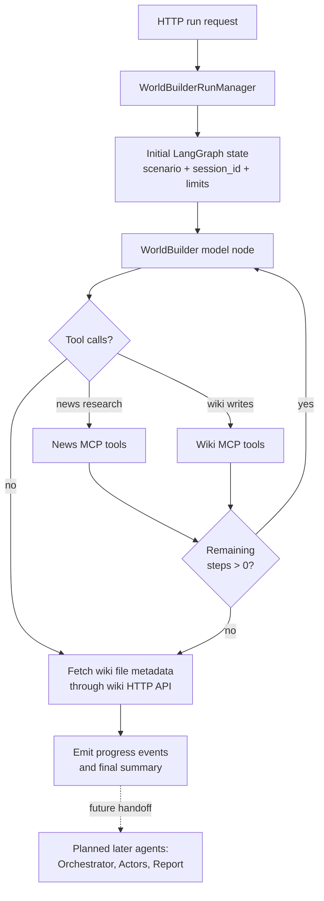

# Current Agent Flow

```mermaid
flowchart TD
    start["HTTP run request"]
    manager["WorldBuilderRunManager"]
    state["Initial LangGraph state\nscenario + session_id + limits"]
    model["WorldBuilder model node"]
    route{"Tool calls?"}
    news["News MCP tools"]
    wiki["Wiki MCP tools"]
    steps{"Remaining\nsteps > 0?"}
    snapshot["Fetch wiki file metadata\nthrough wiki HTTP API"]
    summary["Emit progress events\nand final summary"]
    future["Planned later agents:\nOrchestrator, Actors, Report"]

    start --> manager
    manager --> state
    state --> model
    model --> route
    route -- "news research" --> news
    route -- "wiki writes" --> wiki
    news --> steps
    wiki --> steps
    steps -- "yes" --> model
    route -- "no" --> snapshot
    steps -- "no" --> snapshot
    snapshot --> summary
    summary -. future handoff .-> future
```
