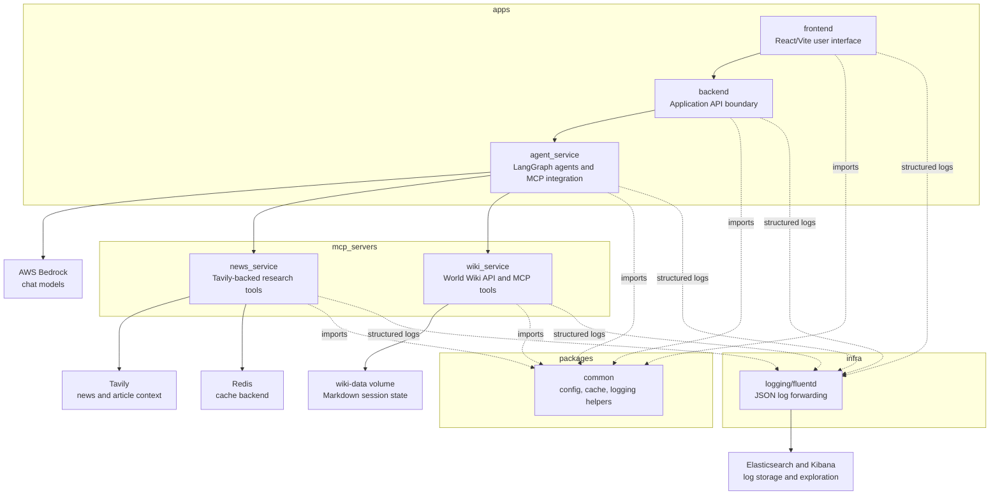

# High-Level Architecture

```mermaid
flowchart TB
    subgraph apps["apps"]
        frontend["frontend\nReact/Vite user interface"]
        backend["backend\nApplication API boundary"]
        agent["agent_service\nLangGraph agents and MCP integration"]
    end

    subgraph mcp["mcp_servers"]
        news["news_service\nTavily-backed research tools"]
        wiki["wiki_service\nWorld Wiki API and MCP tools"]
    end

    subgraph packages["packages"]
        common["common\nconfig, cache, logging helpers"]
    end

    subgraph infra["infra"]
        fluentd["logging/fluentd\nJSON log forwarding"]
    end

    redis["Redis\ncache backend"]
    bedrock["AWS Bedrock\nchat models"]
    tavily["Tavily\nnews and article context"]
    wiki_data["wiki-data volume\nMarkdown session state"]
    logs["Elasticsearch and Kibana\nlog storage and exploration"]

    frontend --> backend
    backend --> agent
    agent --> bedrock
    agent --> news
    agent --> wiki
    news --> tavily
    news --> redis
    wiki --> wiki_data

    frontend -. imports .-> common
    backend -. imports .-> common
    agent -. imports .-> common
    news -. imports .-> common
    wiki -. imports .-> common

    frontend -. structured logs .-> fluentd
    backend -. structured logs .-> fluentd
    agent -. structured logs .-> fluentd
    news -. structured logs .-> fluentd
    wiki -. structured logs .-> fluentd
    fluentd --> logs
```
