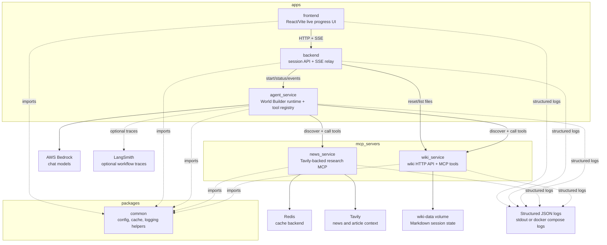

# High-Level Architecture

```mermaid
flowchart TB
    subgraph apps["apps"]
        frontend["frontend\nReact/Vite live progress UI"]
        backend["backend\nsession API + SSE relay"]
        agent["agent_service\nWorld Builder runtime + tool registry"]
    end

    subgraph mcp["mcp_servers"]
        news["news_service\nTavily-backed research MCP"]
        wiki["wiki_service\nwiki HTTP API + MCP tools"]
    end

    subgraph packages["packages"]
        common["common\nconfig, cache, logging helpers"]
    end

    redis["Redis\ncache backend"]
    bedrock["AWS Bedrock\nchat models"]
    tavily["Tavily\nnews and article context"]
    wiki_data["wiki-data volume\nMarkdown session state"]
    langsmith["LangSmith\noptional workflow traces"]
    logs["Structured JSON logs\nstdout or docker compose logs"]

    frontend -->|"HTTP + SSE"| backend
    backend -->|"reset/list files"| wiki
    backend -->|"start/status/events"| agent
    agent -->|"discover + call tools"| news
    agent -->|"discover + call tools"| wiki
    agent --> bedrock
    news --> tavily
    news --> redis
    wiki --> wiki_data
    agent -. optional traces .-> langsmith

    frontend -. imports .-> common
    backend -. imports .-> common
    agent -. imports .-> common
    news -. imports .-> common
    wiki -. imports .-> common

    frontend -. structured logs .-> logs
    backend -. structured logs .-> logs
    agent -. structured logs .-> logs
    news -. structured logs .-> logs
    wiki -. structured logs .-> logs
```
