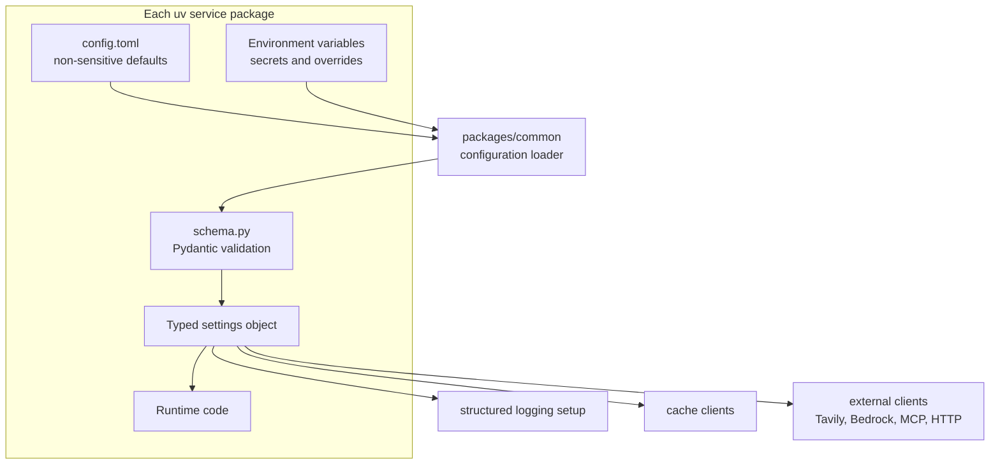

# Configuration

```mermaid
flowchart TB
    subgraph service["Each uv service package"]
        toml["config.toml\nnon-sensitive defaults"]
        env["Environment variables\nsecrets and overrides"]
        schema["schema.py\nPydantic validation"]
        settings["Typed settings object"]
        runtime["Runtime code"]
    end

    common["packages/common\nconfiguration loader"]
    logger["structured logging setup"]
    cache["cache clients"]
    clients["external clients\nTavily, Bedrock, MCP, HTTP"]

    toml --> common
    env --> common
    common --> schema
    schema --> settings
    settings --> runtime
    settings --> logger
    settings --> cache
    settings --> clients
```
