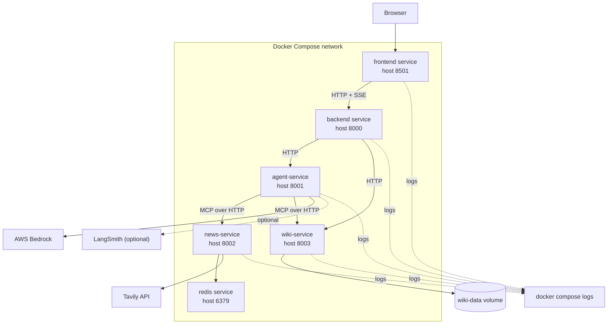

# Service Deployment

```mermaid
flowchart TB
    subgraph compose["Docker Compose network"]
        frontend["frontend service\nhost 8501"]
        backend["backend service\nhost 8000"]
        agent["agent-service\nhost 8001"]
        news["news-service\nhost 8002"]
        wiki["wiki-service\nhost 8003"]
        redis["redis service\nhost 6379"]
    end

    browser["Browser"]
    tavily["Tavily API"]
    bedrock["AWS Bedrock"]
    langsmith["LangSmith (optional)"]
    wiki_volume[("wiki-data volume")]
    logs["docker compose logs"]

    browser --> frontend
    frontend -->|"HTTP + SSE"| backend
    backend -->|"HTTP"| agent
    backend -->|"HTTP"| wiki
    agent -->|"MCP over HTTP"| news
    agent -->|"MCP over HTTP"| wiki
    news --> redis
    news --> tavily
    agent --> bedrock
    agent -. optional .-> langsmith
    wiki --> wiki_volume
    frontend -. logs .-> logs
    backend -. logs .-> logs
    agent -. logs .-> logs
    news -. logs .-> logs
    wiki -. logs .-> logs
```
