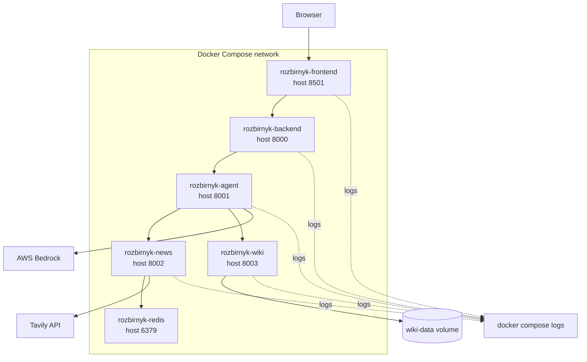

# Service Deployment

```mermaid
flowchart TB
    subgraph compose["Docker Compose network"]
        frontend["rozbirnyk-frontend\nhost 8501"]
        backend["rozbirnyk-backend\nhost 8000"]
        agent["rozbirnyk-agent\nhost 8001"]
        news["rozbirnyk-news\nhost 8002"]
        wiki["rozbirnyk-wiki\nhost 8003"]
        redis["rozbirnyk-redis\nhost 6379"]
    end

    browser["Browser"]
    tavily["Tavily API"]
    bedrock["AWS Bedrock"]
    wiki_volume[("wiki-data volume")]
    logs["docker compose logs"]

    browser --> frontend
    frontend --> backend
    backend --> agent
    agent --> news
    agent --> wiki
    news --> redis
    news --> tavily
    agent --> bedrock
    wiki --> wiki_volume
    frontend -. logs .-> logs
    backend -. logs .-> logs
    agent -. logs .-> logs
    news -. logs .-> logs
    wiki -. logs .-> logs
```
