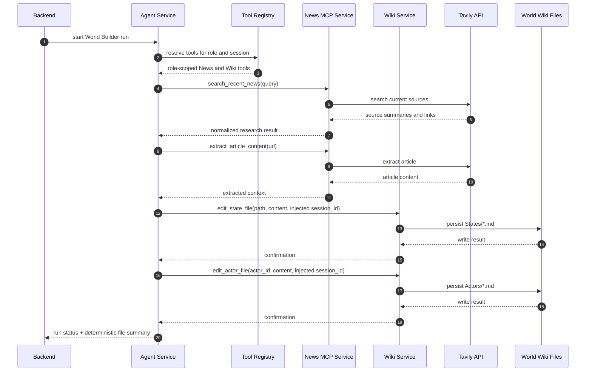

# MCP Service Interactions

```mermaid
sequenceDiagram
    autonumber
    participant Backend as Backend
    participant Agent as Agent Service
    participant Registry as Tool Registry
    participant News as News MCP Service
    participant Wiki as Wiki Service
    participant Tavily as Tavily API
    participant Files as World Wiki Files

    Backend->>Agent: start World Builder run
    Agent->>Registry: resolve tools for role and session
    Registry-->>Agent: role-scoped News and Wiki tools
    Agent->>News: search_recent_news(query)
    News->>Tavily: search current sources
    Tavily-->>News: source summaries and links
    News-->>Agent: normalized research result
    Agent->>News: extract_article_content(url)
    News->>Tavily: extract article
    Tavily-->>News: article content
    News-->>Agent: extracted context
    Agent->>Wiki: edit_state_file(path, content, injected session_id)
    Wiki->>Files: persist States/*.md
    Files-->>Wiki: write result
    Wiki-->>Agent: confirmation
    Agent->>Wiki: edit_actor_file(actor_id, content, injected session_id)
    Wiki->>Files: persist Actors/*.md
    Files-->>Wiki: write result
    Wiki-->>Agent: confirmation
    Agent-->>Backend: run status + deterministic file summary
```
