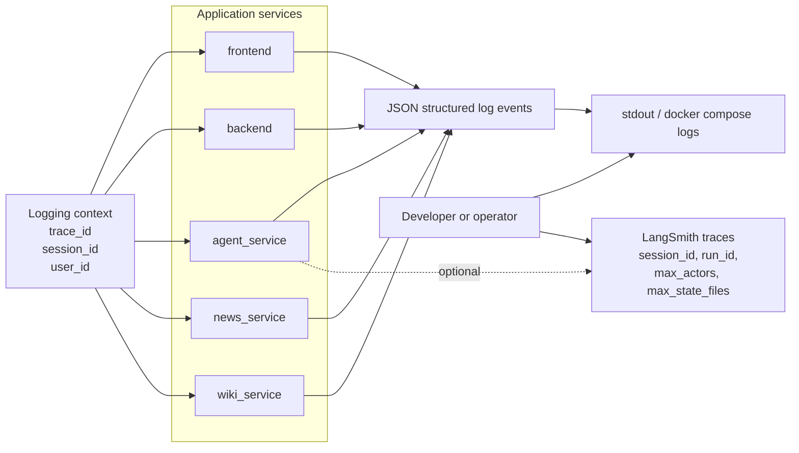

# Observability

```mermaid
flowchart LR
    subgraph services["Application services"]
        frontend["frontend"]
        backend["backend"]
        agent["agent_service"]
        news["news_service"]
        wiki["wiki_service"]
    end

    context["Logging context\ntrace_id\nsession_id\nuser_id"]
    json["JSON structured log events"]
    output["stdout / docker compose logs"]
    tracing["LangSmith traces\nsession_id, run_id,\nmax_actors, max_state_files"]
    operator["Developer or operator"]

    context --> frontend
    context --> backend
    context --> agent
    context --> news
    context --> wiki

    frontend --> json
    backend --> json
    agent --> json
    news --> json
    wiki --> json

    json --> output
    agent -. optional .-> tracing
    operator --> output
    operator --> tracing
```
