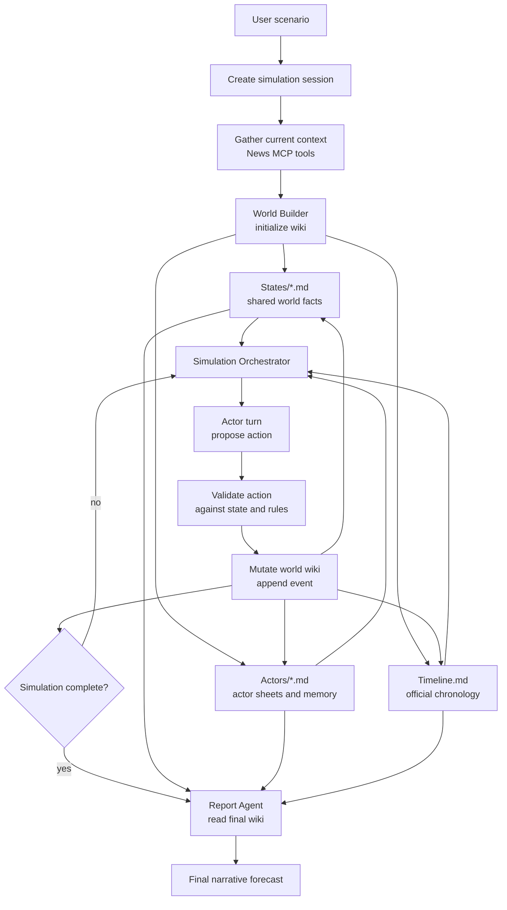

# Simulation Pipeline

```mermaid
flowchart TD
    prompt["User scenario"]
    create_session["Create simulation session"]
    research["Gather current context\nNews MCP tools"]
    build_world["World Builder\ninitialize wiki"]
    states["States/*.md\nshared world facts"]
    actors["Actors/*.md\nactor sheets and memory"]
    timeline["Timeline.md\nofficial chronology"]
    orchestrator["Simulation Orchestrator"]
    actor_turn["Actor turn\npropose action"]
    validate["Validate action\nagainst state and rules"]
    mutate["Mutate world wiki\nappend event"]
    done{"Simulation complete?"}
    report["Report Agent\nread final wiki"]
    narrative["Final narrative forecast"]

    prompt --> create_session
    create_session --> research
    research --> build_world
    build_world --> states
    build_world --> actors
    build_world --> timeline
    timeline --> orchestrator
    states --> orchestrator
    actors --> orchestrator
    orchestrator --> actor_turn
    actor_turn --> validate
    validate --> mutate
    mutate --> states
    mutate --> actors
    mutate --> timeline
    mutate --> done
    done -- "no" --> orchestrator
    done -- "yes" --> report
    states --> report
    actors --> report
    timeline --> report
    report --> narrative
```

