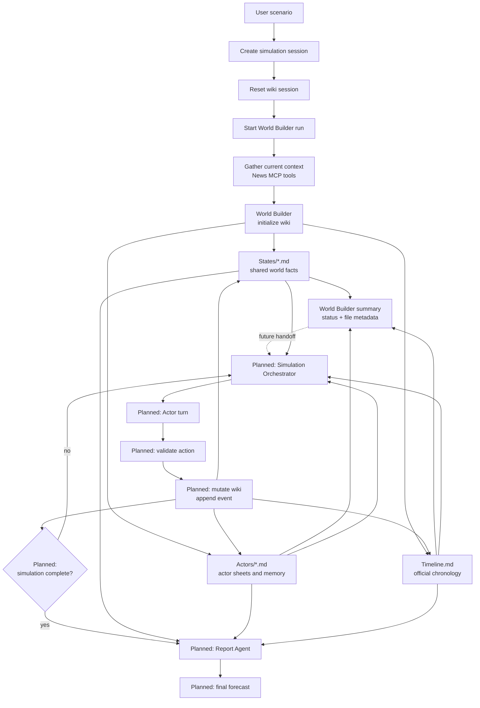

# Implemented And Planned Pipeline

```mermaid
flowchart TD
    prompt["User scenario"]
    create_session["Create simulation session"]
    reset["Reset wiki session"]
    start_builder["Start World Builder run"]
    research["Gather current context\nNews MCP tools"]
    build_world["World Builder\ninitialize wiki"]
    states["States/*.md\nshared world facts"]
    actors["Actors/*.md\nactor sheets and memory"]
    timeline["Timeline.md\nofficial chronology"]
    complete["World Builder summary\nstatus + file metadata"]
    orchestrator["Planned: Simulation Orchestrator"]
    actor_turn["Planned: Actor turn"]
    validate["Planned: validate action"]
    mutate["Planned: mutate wiki\nappend event"]
    done{"Planned:\nsimulation complete?"}
    report["Planned: Report Agent"]
    narrative["Planned: final forecast"]

    prompt --> create_session
    create_session --> reset
    reset --> start_builder
    start_builder --> research
    research --> build_world
    build_world --> states
    build_world --> actors
    build_world --> timeline
    states --> complete
    actors --> complete
    timeline --> complete
    complete -. future handoff .-> orchestrator
    timeline --> orchestrator
    states --> orchestrator
    actors --> orchestrator
    orchestrator --> actor_turn
    actor_turn --> validate
    validate --> mutate
    mutate --> states
    mutate --> actors
    mutate --> timeline
    mutate --> done
    done -- "no" --> orchestrator
    done -- "yes" --> report
    states --> report
    actors --> report
    timeline --> report
    report --> narrative
```
