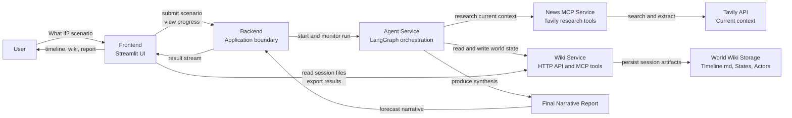

# System Context

```mermaid
flowchart LR
    user["User"]
    frontend["Frontend\nStreamlit UI"]
    backend["Backend\nApplication boundary"]
    agent["Agent Service\nLangGraph orchestration"]
    news["News MCP Service\nTavily research tools"]
    tavily["Tavily API\nCurrent context"]
    wiki["Wiki Service\nHTTP API and MCP tools"]
    storage["World Wiki Storage\nTimeline.md, States, Actors"]
    report["Final Narrative Report"]

    user -->|"What if? scenario"| frontend
    frontend -->|"submit scenario\nview progress"| backend
    backend -->|"start and monitor run"| agent
    agent -->|"research current context"| news
    news -->|"search and extract"| tavily
    agent -->|"read and write world state"| wiki
    frontend -->|"read session files\nexport results"| wiki
    wiki -->|"persist session artifacts"| storage
    agent -->|"produce synthesis"| report
    report -->|"forecast narrative"| backend
    backend -->|"result stream"| frontend
    frontend -->|"timeline, wiki, report"| user
```

