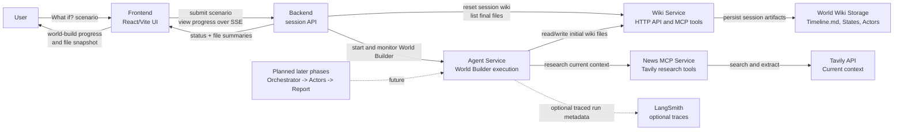

# System Context

```mermaid
flowchart LR
    user["User"]
    frontend["Frontend\nReact/Vite UI"]
    backend["Backend\nsession API"]
    agent["Agent Service\nWorld Builder execution"]
    news["News MCP Service\nTavily research tools"]
    tavily["Tavily API\nCurrent context"]
    wiki["Wiki Service\nHTTP API and MCP tools"]
    storage["World Wiki Storage\nTimeline.md, States, Actors"]
    langsmith["LangSmith\noptional traces"]
    roadmap["Planned later phases\nOrchestrator -> Actors -> Report"]

    user -->|"What if? scenario"| frontend
    frontend -->|"submit scenario\nview progress over SSE"| backend
    backend -->|"reset session wiki\nlist final files"| wiki
    backend -->|"start and monitor World Builder"| agent
    agent -->|"research current context"| news
    news -->|"search and extract"| tavily
    agent -->|"read/write initial wiki files"| wiki
    wiki -->|"persist session artifacts"| storage
    agent -.->|"optional traced run metadata"| langsmith
    backend -->|"status + file summaries"| frontend
    frontend -->|"world-build progress\nand file snapshot"| user
    roadmap -. future .-> agent
```
