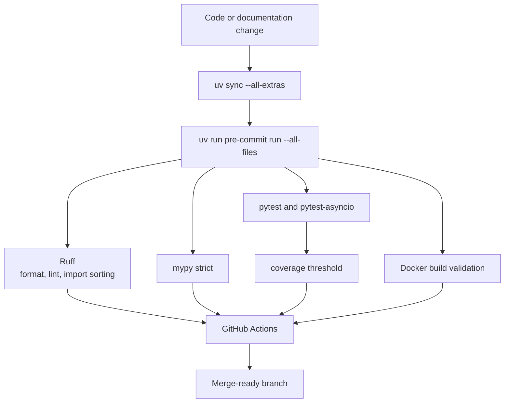

# Testing And CI

```mermaid
flowchart TD
    change["Code or documentation change"]
    sync["uv sync --all-extras"]
    precommit["uv run pre-commit run --all-files"]
    ruff["Ruff\nformat, lint, import sorting"]
    mypy["mypy strict"]
    pytest["pytest and pytest-asyncio"]
    coverage["coverage threshold"]
    docker["Docker build validation"]
    ci["GitHub Actions"]
    merge["Merge-ready branch"]

    change --> sync
    sync --> precommit
    precommit --> ruff
    precommit --> mypy
    precommit --> pytest
    pytest --> coverage
    precommit --> docker
    ruff --> ci
    mypy --> ci
    coverage --> ci
    docker --> ci
    ci --> merge
```

