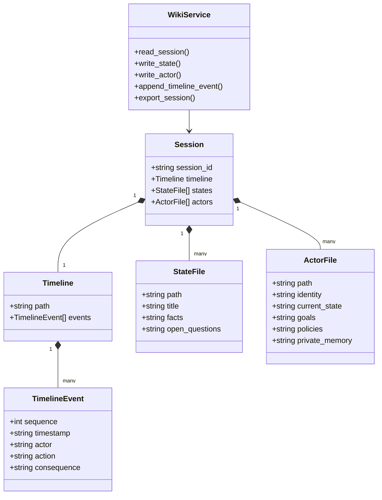

# World Wiki Data Model

```mermaid
classDiagram
    class Session {
        +string session_id
        +Timeline timeline
        +StateFile[] states
        +ActorFile[] actors
    }

    class Timeline {
        +string path
        +TimelineEvent[] events
    }

    class TimelineEvent {
        +int sequence
        +string timestamp
        +string actor
        +string action
        +string consequence
    }

    class StateFile {
        +string path
        +string title
        +string facts
        +string open_questions
    }

    class ActorFile {
        +string path
        +string identity
        +string current_state
        +string goals
        +string policies
        +string private_memory
    }

    class WikiService {
        +read_session()
        +write_state()
        +write_actor()
        +append_timeline_event()
        +export_session()
    }

    Session "1" *-- "1" Timeline
    Session "1" *-- "many" StateFile
    Session "1" *-- "many" ActorFile
    Timeline "1" *-- "many" TimelineEvent
    WikiService --> Session
```

